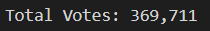
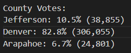
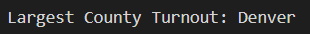
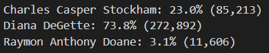
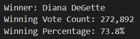

# Election_Analysis (Python project)

## Overview of Project

In this project, we were working on a election result data-set using Python to automate tasks and conduct data analysis.
Python handles large data files and performs complex calculations quickly and helps to access, process, manipulate and store data.

### Purpose

The main purpose of this project was to conduct a election audit on the tabulated results for a US congressional
precinct using python to get a summary of the election results. Various parameters were calculated to analyse the election
results:
- Total votes,
- Votes cast for each candidate
- Percentage of votes cast for each canditate
- Winning canditate and winning vote-count

## Election-Audit Results

- Total votes cast in congressional election:

We used the following logic to compute the total votes:

```
Initialize a total vote counter to 0

Loop through rows of data
    Increment total vote counter by 1
Loop End
```
Using above logic, we determined that the total number of votes cast in the election were **369,711** as shown in the image below:



- Breakdown of the number of votes and the percentage of total votes for each county in the precinct:

We used the following logic to compute the number of votes and percentage of votes for each county in the precinct: 

```
Initialize a dictionary with `county name` as the key and `number of votes` as the value

Loop through rows of data
    Extract the `county name` from each row
    Increment the `number of votes` saved in the dictionary with `county name` keyby 1 if the current
    row holds data for `county name`
Loop End
``` 
Using above logic, we determined number of votes and percentage for each county in the election as shown in the image below:



- County with largest number of votes:

To get the county with highest number of votes, we have used the following logic:

```
Initialize `highest votes` to 0
Initialize `winning county` to empty string
Loop through rows of data
    Extract `vote count` from each row
    if `vote count` >= `highest votes`
        `highest votes` = `vote count`
        store the county name corresponding to `vote count` in `winning county`
Loop End
```
Using above logic, we determined that the county with the highest number of votes was **Denver** as shown in
the below image: 



- Breakdown of the number of votes and the percentage of the total votes for each candidate:

In order to calculate the number of votes canditate-wise, following logic was used:

```
Initialize a dictionary with `candidate name` as the key and `number of votes` as the value

Loop through rows of data
    Extract the `candidate name` from each row
    Increment the `number of votes` saved in the dictionary with `candidate name` key by 1 if the current row holds data for
    `candidate name`
Loop End
``` 
Using above logic, we determined the number of votes and percentage for each candidate in the election as shown in the image below:



- Determining Winning candidate, winning vote count and winning percentage:

The winner of the election was determined by using below logic: 
```
Initialize `winning candidate` to empty string
Initialize `winning votes` to 0
Initialize `winning percentage` to 0

Loop through rows of data
    Extract the `candidate name` from each row
    Extract the `candidate votes` from each row
    Calculate the `vote percentage` for `canditate name` using `total votes`
    if `candidate votes` > `winning votes` and `vote percentage` > `winning percentage`
        `winning votes` = `candidate votes`
        `winning candidate` = `candidate name`
        `winning percentage` = `vote percentage`
Loop End
```
Using above logic, we determined that **Diana DeGette** won the election after receiving **272,892** votes
which was almost **73.8%** of the total votes cast in the election. The summary of the election winner can be
seen below:




